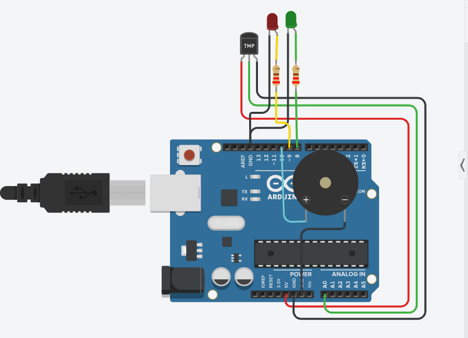
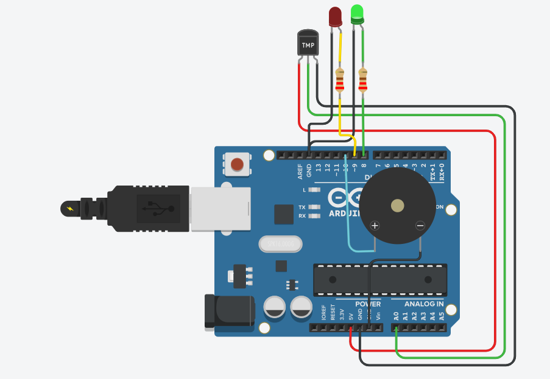
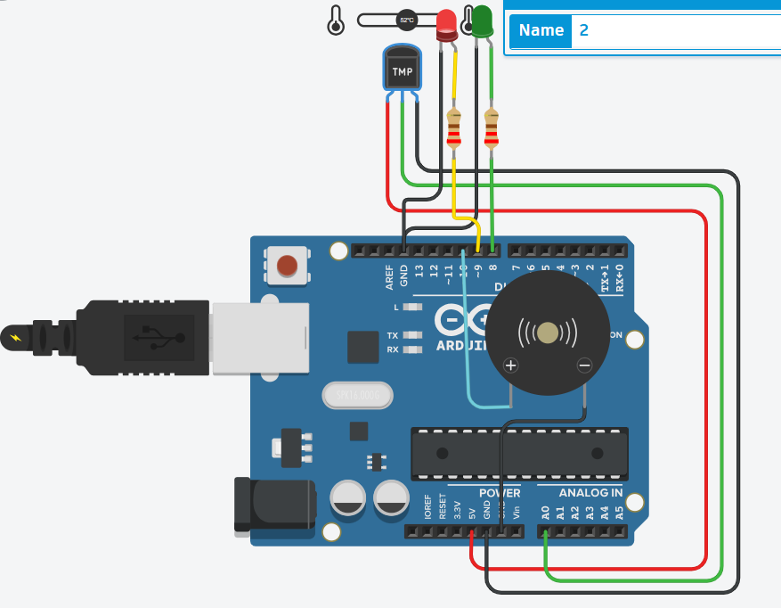

# Smart Fire Detection System 🔥

## Overview

The Smart Fire Detection System is an Arduino Uno–based safety monitoring project that continuously measures ambient temperature using a TMP36 temperature sensor. The system identifies abnormal temperature conditions and provides both visual and audible alerts, making it suitable for demonstrating basic fire monitoring and embedded system automation.

---

## Features

- Real-time temperature monitoring
- Automatic fire risk detection using threshold values
- LED-based system status indication
- Audible alarm using a piezo buzzer
- Live sensor readings on the Serial Monitor

---

## Components Used

| Component | Quantity |
|----------|:--------:|
| Arduino Uno | 1 |
| TMP36 Temperature Sensor | 1 |
| Green LED | 1 |
| Red LED | 1 |
| Piezo Buzzer | 1 |
| 220Ω Resistors | 2 |
| Jumper Wires | As Required |

---

## Pin Connections

| Component | Arduino Pin |
|----------|-------------|
| TMP36 Sensor | A0 |
| Green LED | D8 |
| Red LED | D9 |
| Piezo Buzzer | D6 |

---

## Working Principle

The TMP36 temperature sensor continuously measures the surrounding temperature and sends an analog voltage to the Arduino Uno.

The Arduino converts the analog value into temperature in degrees Celsius and compares it against a predefined threshold.

- **Normal Temperature**
  - Green LED ON
  - Red LED OFF
  - Buzzer OFF

- **High Temperature**
  - Red LED ON
  - Green LED OFF
  - Buzzer ON
  - Warning displayed on the Serial Monitor

---

## Project Structure

```
Day-01-Smart-Fire-Detection-System/
│
├── circuit/
│   └── circuit_diagram.png
│
├── code/
│   └── smart_fire_detection.ino
│
├── docs/
│   └── architecture.md
│
├── screenshots/
│   ├── normal_mode.png
│   ├── alert_mode.png
│   └── serial_monitor.png
│
└── README.md
```

---

## Screenshots

### Circuit Diagram



### Normal Mode



### Alert Mode



### Serial Monitor


---

## Concepts Learned

- Analog sensor interfacing
- ADC (Analog-to-Digital Conversion)
- Temperature monitoring
- GPIO programming
- Threshold-based decision making
- Serial communication for debugging

---

## Future Improvements

- ESP32 Wi-Fi integration
- Email and mobile notifications
- Cloud-based temperature logging
- Web dashboard for remote monitoring
- Historical temperature analytics

---

## Author

**Smruthi Nayak**

B.Tech Computer Science Engineering