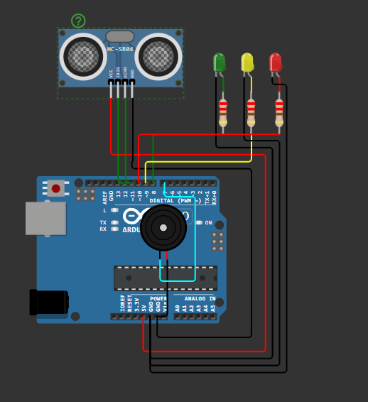
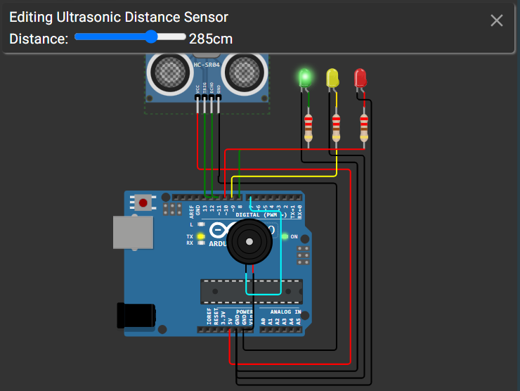
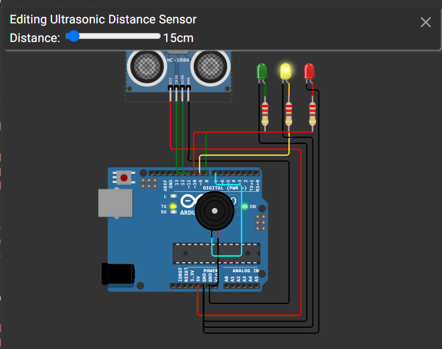
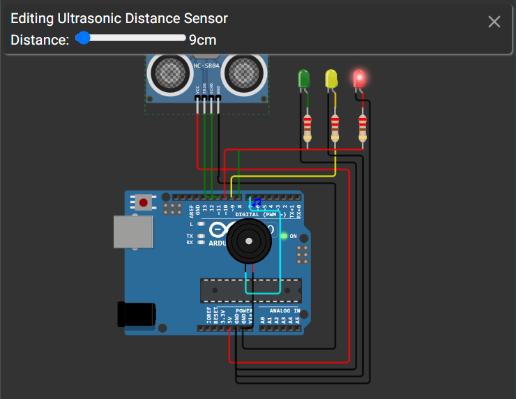
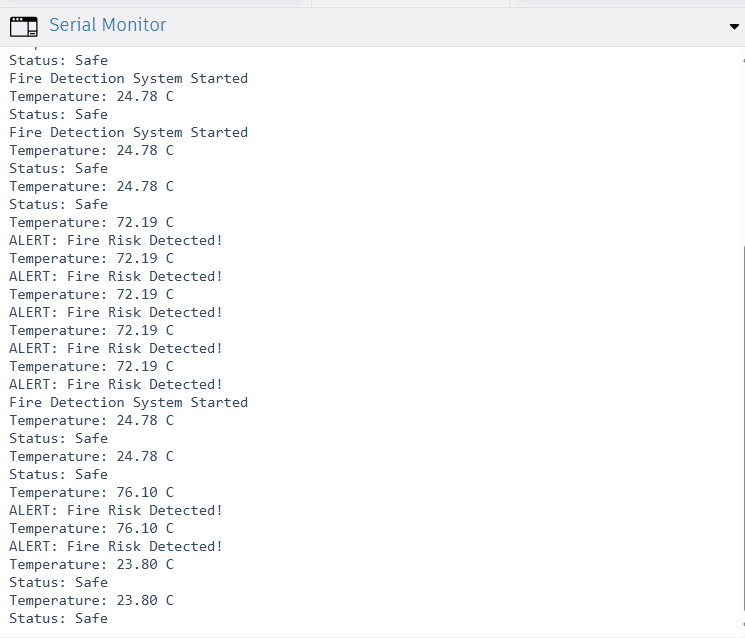

# Smart Water Tank Level Monitor 💧

## Overview

The Smart Water Tank Level Monitor is an Arduino Uno–based monitoring system that measures the water level inside a tank using an HC-SR04 ultrasonic sensor. Based on the measured distance, the system classifies the tank level as **Low**, **Medium**, or **Full**, providing visual status indication through LEDs, audible alerts using a buzzer, and real-time updates on the Serial Monitor.

---

## Features

- Real-time water level monitoring
- Non-contact distance measurement using an ultrasonic sensor
- Three-level status indication (Low, Medium, Full)
- LED-based visual alerts
- Audible notification using a piezo buzzer
- Live monitoring through the Serial Monitor

---

## Components Used

| Component | Quantity |
|----------|:--------:|
| Arduino Uno | 1 |
| HC-SR04 Ultrasonic Sensor | 1 |
| Red LED | 1 |
| Yellow LED | 1 |
| Green LED | 1 |
| Piezo Buzzer | 1 |
| 220Ω Resistors | 3 |
| Jumper Wires | As Required |

---

## Pin Connections

| Component | Arduino Pin |
|----------|-------------|
| HC-SR04 Trigger | D3 |
| HC-SR04 Echo | D2 |
| Green LED | D8 |
| Yellow LED | D9 |
| Red LED | D10 |
| Piezo Buzzer | D6 |

> **Note:** Update the pin numbers if they differ from your Arduino sketch.

---

## Working Principle

The HC-SR04 ultrasonic sensor continuously measures the distance between the sensor and the water surface.

The Arduino calculates the water level from the measured distance and compares it against predefined thresholds.

- **Tank Full**
  - Green LED ON
  - Yellow LED OFF
  - Red LED OFF
  - Buzzer OFF

- **Medium Level**
  - Yellow LED ON
  - Green LED OFF
  - Red LED OFF
  - Short buzzer indication (optional)

- **Low Water Level**
  - Red LED ON
  - Buzzer ON
  - Warning displayed on the Serial Monitor

---

## Project Structure

```text
Day-02-Smart-Water-Tank-Level-Monitor/
│
├── circuit/
│   └── circuit_diagram.png
│
├── code/
│   └── smart_water_tank_level_monitor.ino
│
├── docs/
│   └── architecture.md
│
├── screenshots/
│   ├── low_water.png
│   ├── medium_level.png
│   ├── tank_full.png
│   └── serial_monitor.png
│
└── README.md
```

---

## Screenshots

### Circuit Diagram



### Low Water Level



### Medium Water Level



### Tank Full



### Serial Monitor



---

## Concepts Learned

- Ultrasonic sensor interfacing
- Distance measurement using time-of-flight
- Threshold-based decision making
- GPIO programming
- Embedded automation
- Serial communication for monitoring

---

## Future Improvements

- Automatic water pump control
- ESP32 Wi-Fi integration
- IoT dashboard for remote monitoring
- Email and mobile notifications
- Cloud-based water level logging

---

## Author

**Smruthi Nayak**

B.Tech Computer Science Engineering