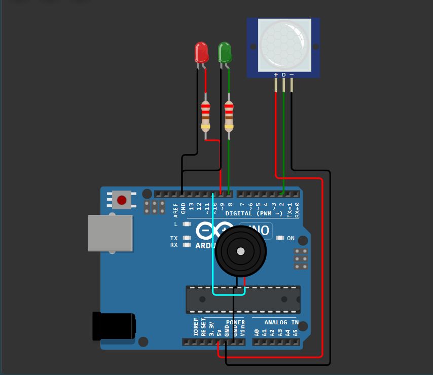
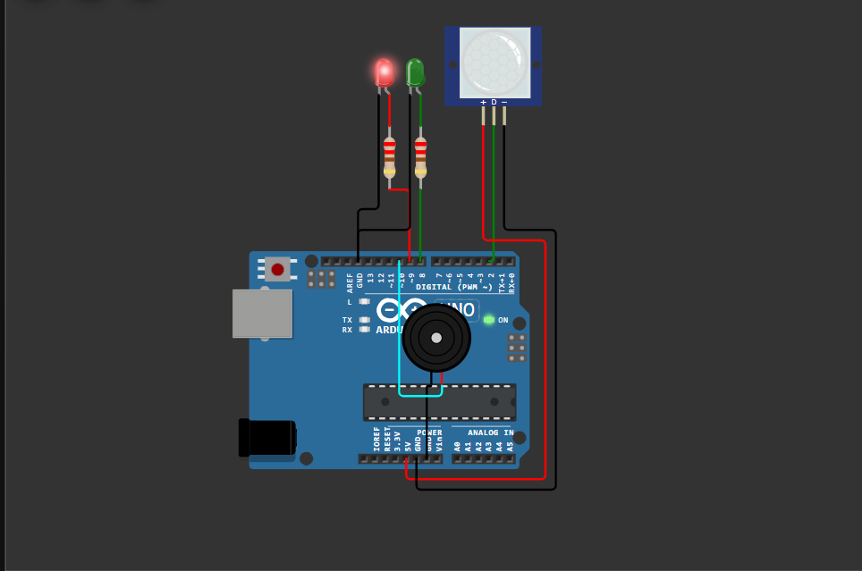
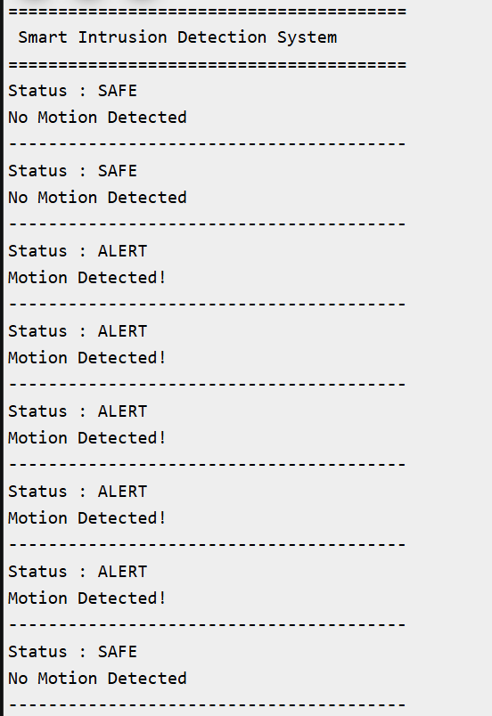

# Smart Intrusion Detection System 🚨

## Overview

The Smart Intrusion Detection System is an Arduino Uno–based security project that detects unauthorized movement using a PIR (Passive Infrared) motion sensor. When motion is detected, the system activates visual and audible alerts while displaying the current security status on the Serial Monitor.

---

## Features

- Real-time motion detection
- PIR sensor-based intrusion monitoring
- LED-based status indication
- Audible alarm using a piezo buzzer
- Live status updates on the Serial Monitor

---

## Components Used

| Component | Quantity |
|----------|:--------:|
| Arduino Uno | 1 |
| PIR Motion Sensor | 1 |
| Green LED | 1 |
| Red LED | 1 |
| Piezo Buzzer | 1 |
| 220Ω Resistors | 2 |
| Jumper Wires | As Required |

---

## Pin Connections

| Component | Arduino Pin |
|----------|-------------|
| PIR Motion Sensor | D2 |
| Green LED | D8 |
| Red LED | D9 |
| Piezo Buzzer | D6 |

> **Note:** Update the pin numbers if they differ from your Arduino sketch.

---

## Working Principle

The PIR motion sensor continuously monitors the surrounding area for movement.

The Arduino reads the sensor output and determines the system status.

- **Safe Mode**
  - Green LED ON
  - Red LED OFF
  - Buzzer OFF
  - "No Motion Detected" displayed on the Serial Monitor

- **Intrusion Detected**
  - Red LED ON
  - Green LED OFF
  - Buzzer ON
  - "Motion Detected!" displayed on the Serial Monitor

---

## Project Structure

```text
Day-03-Smart-Intrusion-Detection-System/
│
├── circuit/
│   └── circuit_diagram.png
│
├── code/
│   └── smart_intrusion_detection.ino
│
├── docs/
│   └── architecture.md
│
├── screenshots/
│   ├── safe_mode.png
│   ├── alert_mode.png
│   └── serial_monitor.png
│
└── README.md
```

---

## Screenshots

### Circuit Diagram



### Safe Mode


### Alert Mode



### Serial Monitor



---

## Concepts Learned

- PIR sensor interfacing
- Digital input processing
- GPIO programming
- Motion detection systems
- Alarm system implementation
- Serial communication for debugging

---

## Future Improvements

- ESP32 Wi-Fi integration
- Email and mobile notifications
- Cloud event logging
- Web dashboard for remote monitoring
- Camera integration for image capture

---

## Author

**Smruthi Nayak**

B.Tech Computer Science Engineering