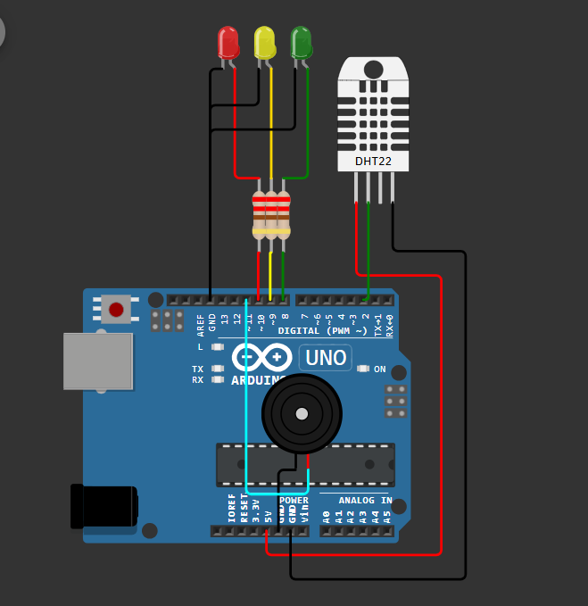
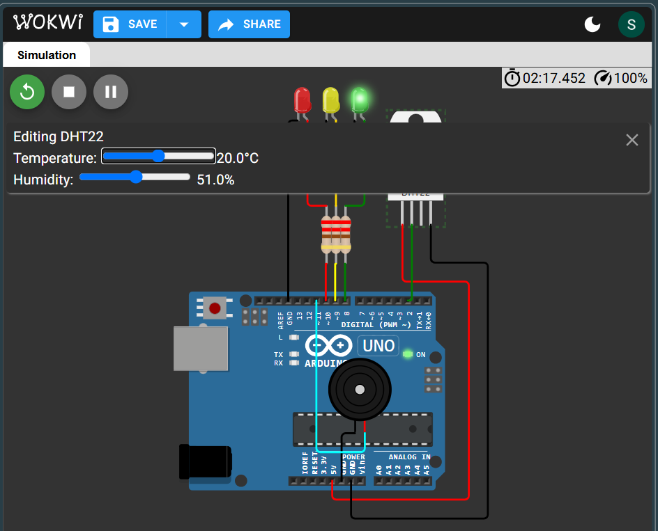
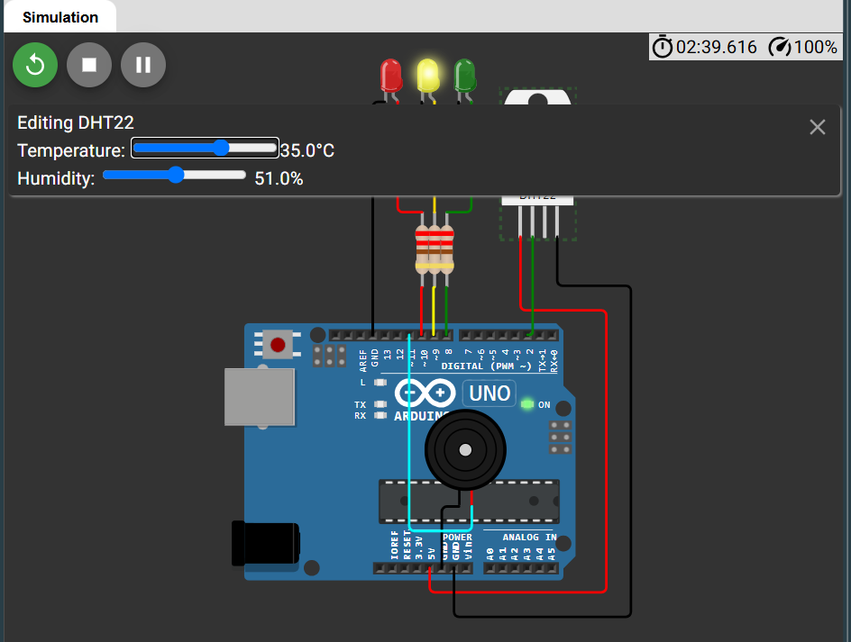
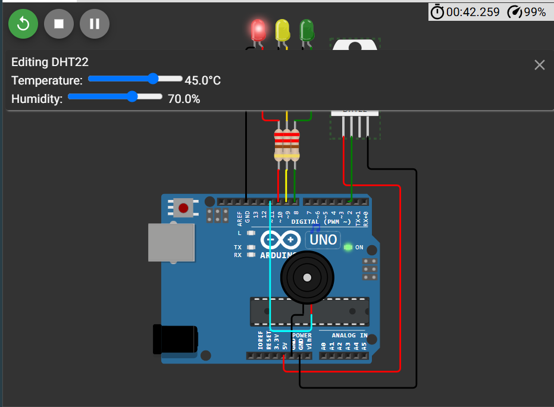
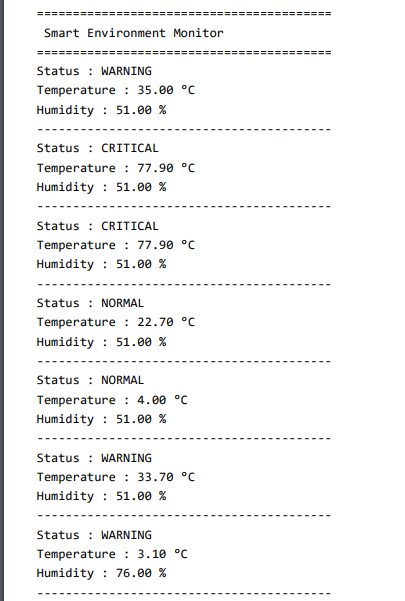

# Smart Environment Monitor 🌡️💧

## Overview

The Smart Environment Monitor is an Arduino Uno–based monitoring system that continuously measures temperature and humidity using a DHT22 sensor. Based on predefined environmental thresholds, the system classifies conditions as **Normal**, **Warning**, or **Critical**, providing visual indications through LEDs, audible alerts using a piezo buzzer, and real-time readings on the Serial Monitor.

---

## Features

- Real-time temperature monitoring
- Real-time humidity monitoring
- Three environmental status levels
- LED-based status indication
- Audible alert using a piezo buzzer
- Live monitoring through the Serial Monitor

---

## Components Used

| Component | Quantity |
|----------|:--------:|
| Arduino Uno | 1 |
| DHT22 Temperature & Humidity Sensor | 1 |
| Green LED | 1 |
| Yellow LED | 1 |
| Red LED | 1 |
| Piezo Buzzer | 1 |
| 220Ω Resistors | 3 |
| Jumper Wires | As Required |

---

## Pin Connections

| Component | Arduino Pin |
|----------|-------------|
| DHT22 Data Pin | D2 |
| Green LED | D8 |
| Yellow LED | D9 |
| Red LED | D10 |
| Piezo Buzzer | D6 |

> **Note:** Update the pin numbers if they differ from your Arduino sketch.

---

## Working Principle

The DHT22 sensor continuously measures the surrounding temperature and humidity.

The Arduino reads the sensor values and compares them against predefined thresholds to determine the environmental condition.

- **Normal**
  - Green LED ON
  - Yellow LED OFF
  - Red LED OFF
  - Buzzer OFF

- **Warning**
  - Yellow LED ON
  - Green LED OFF
  - Red LED OFF
  - Buzzer OFF

- **Critical**
  - Red LED ON
  - Green LED OFF
  - Yellow LED OFF
  - Buzzer ON
  - Critical status displayed on the Serial Monitor

---

## Project Structure

```text
Day-04-Smart-Environment-Monitor/
│
├── circuit/
│   └── circuit_diagram.png
│
├── code/
│   └── smart_environment_monitor.ino
│
├── docs/
│   └── architecture.md
│
├── screenshots/
│   ├── normal_mode.png
│   ├── warning_mode.png
│   ├── alert_mode.png
│   └── serial_monitor.png
│
└── README.md
```

---

## Screenshots

### Circuit Diagram



### Normal Mode



### Warning Mode



### Critical Mode



### Serial Monitor



---

## Concepts Learned

- DHT22 sensor interfacing
- Temperature and humidity monitoring
- Digital sensor communication
- Multi-parameter data processing
- Threshold-based decision making
- Serial communication for debugging

---

## Future Improvements

- ESP32 Wi-Fi connectivity
- Email and mobile notifications
- Cloud-based environmental monitoring
- Web dashboard for remote visualization
- Historical data logging and analytics

---

## Author

**Smruthi Nayak**

B.Tech Computer Science Engineering