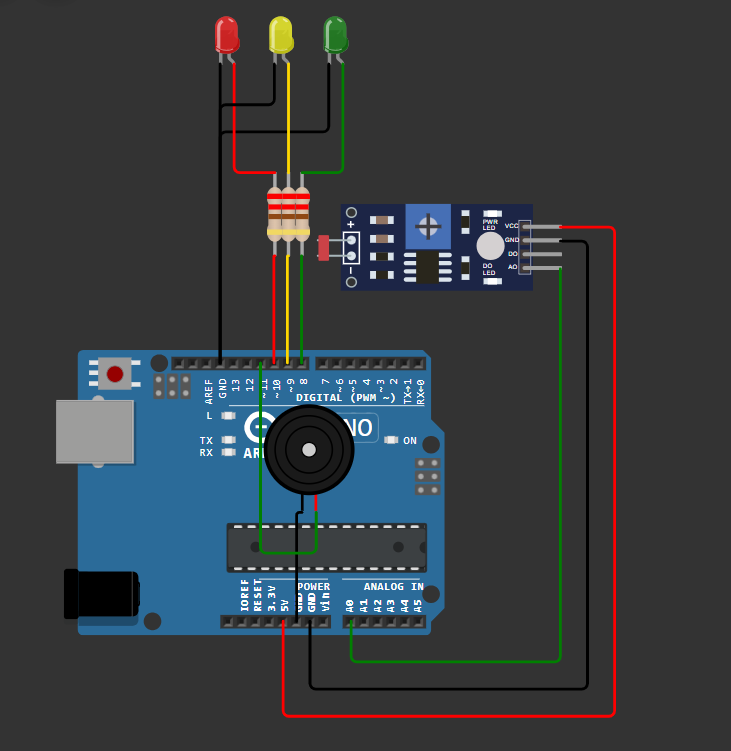
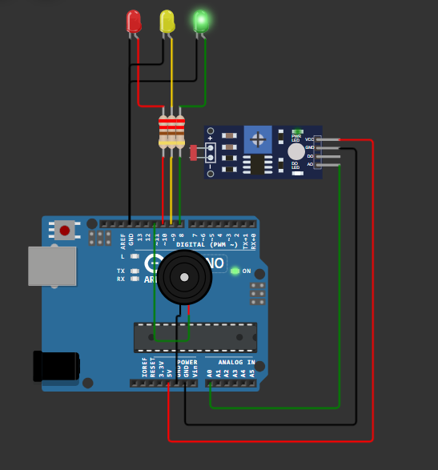
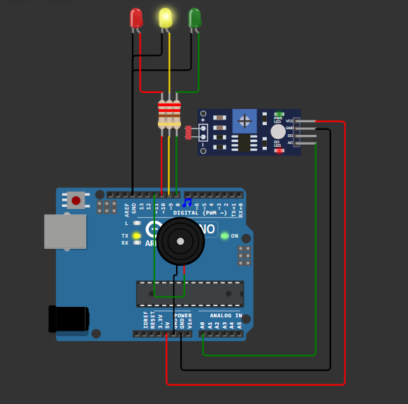
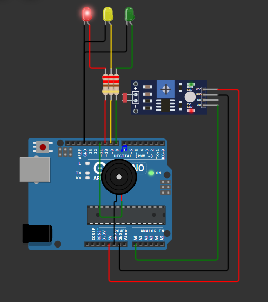
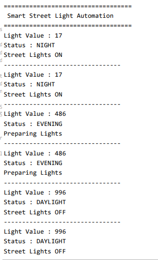

# Smart Street Light Automation 💡

## Overview

The Smart Street Light Automation system is an Arduino Uno–based project that automatically monitors ambient light intensity using an LDR (Light Dependent Resistor) sensor. Based on the measured light level, the system classifies the environment as **Daylight**, **Evening**, or **Night**, providing visual status indication through LEDs, audible alerts using a piezo buzzer, and real-time updates on the Serial Monitor.

---

## Features

- Automatic ambient light detection
- Real-time LDR sensor monitoring
- Three lighting conditions (Daylight, Evening, Night)
- LED-based status indication
- Audible alerts using a piezo buzzer
- Live monitoring through the Serial Monitor

---

## Components Used

| Component | Quantity |
|----------|:--------:|
| Arduino Uno | 1 |
| LDR Sensor Module | 1 |
| Green LED | 1 |
| Yellow LED | 1 |
| Red LED | 1 |
| Piezo Buzzer | 1 |
| 220Ω Resistors | 3 |
| Jumper Wires | As Required |

---

## Pin Connections

| Component | Arduino Pin |
|----------|-------------|
| LDR Sensor (AO) | A0 |
| Green LED | D8 |
| Yellow LED | D9 |
| Red LED | D10 |
| Piezo Buzzer | D11 |

---

## Working Principle

The LDR sensor continuously measures the surrounding light intensity and sends an analog signal to the Arduino Uno.

The Arduino compares the sensor reading with predefined thresholds to determine the lighting condition.

- **Daylight**
  - Green LED ON
  - Yellow LED OFF
  - Red LED OFF
  - Buzzer OFF
  - Street lights remain OFF

- **Evening**
  - Yellow LED ON
  - Green LED OFF
  - Red LED OFF
  - Short buzzer indication
  - System prepares for low-light conditions

- **Night**
  - Red LED ON
  - Green LED OFF
  - Yellow LED OFF
  - Buzzer ON
  - Street lights are activated

The current light level and system status are continuously displayed on the Serial Monitor.

---

## Project Structure

```text
Day-05-Smart-Street-Light-Automation/
│
├── circuit/
│   └── circuit_diagram.png
│
├── code/
│   └── smart_street_light_automation.ino
│
├── docs/
│   └── architecture.md
│
├── screenshots/
│   ├── daylight_mode.png
│   ├── evening_mode.png
│   ├── night_mode.png
│   └── serial_monitor.png
│
└── README.md
```

---

## Screenshots

### Circuit Diagram



### Daylight Mode



### Evening Mode



### Night Mode



### Serial Monitor



---

## Concepts Learned

- LDR sensor interfacing
- Analog-to-Digital Conversion (ADC)
- Ambient light measurement
- Threshold-based automation
- GPIO programming
- Serial communication for monitoring

---

## Future Improvements

- Automatic relay-controlled street lights
- ESP32 Wi-Fi connectivity
- Remote monitoring through a web dashboard
- Cloud-based light intensity logging
- Energy consumption analytics

---

## Author

**Smruthi Nayak**

B.Tech Computer Science Engineering