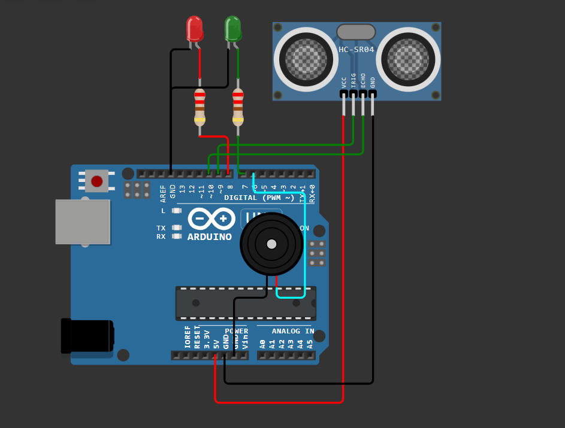
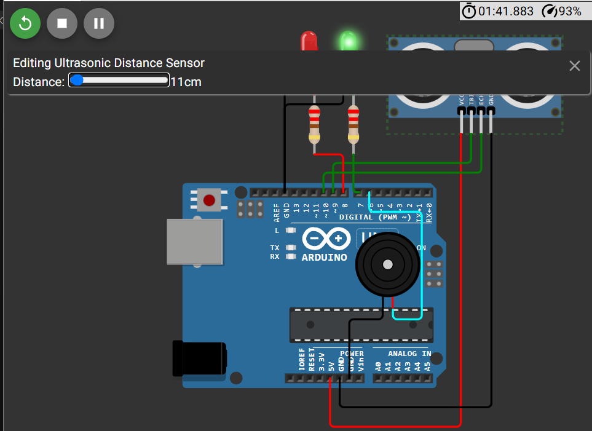
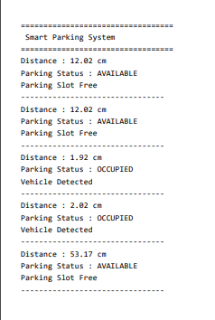

# Smart Parking System 🚗

## Overview

The Smart Parking System is an Arduino Uno–based automation project that uses an HC-SR04 ultrasonic sensor to detect the presence of a vehicle in a parking slot. Based on the measured distance, the system identifies whether the parking space is **Available** or **Occupied**, providing visual indications through LEDs, audible alerts using a piezo buzzer, and real-time status updates on the Serial Monitor.

---

## Features

- Automatic vehicle detection
- Real-time parking slot monitoring
- Parking availability indication
- LED-based status indication
- Audible notification using a piezo buzzer
- Live monitoring through the Serial Monitor

---

## Components Used

| Component | Quantity |
|----------|:--------:|
| Arduino Uno | 1 |
| HC-SR04 Ultrasonic Sensor | 1 |
| Green LED | 1 |
| Red LED | 1 |
| Piezo Buzzer | 1 |
| 220Ω Resistors | 2 |
| Jumper Wires | As Required |

---

## Pin Connections

| Component | Arduino Pin |
|----------|-------------|
| HC-SR04 Trigger | D9 |
| HC-SR04 Echo | D10 |
| Green LED | D7 |
| Red LED | D8 |
| Piezo Buzzer | D6 |

---

## Working Principle

The HC-SR04 ultrasonic sensor continuously measures the distance between the sensor and nearby objects.

The Arduino compares the measured distance with a predefined threshold to determine whether the parking space is occupied.

- **Parking Available**
  - Green LED ON
  - Red LED OFF
  - Buzzer OFF
  - Parking slot marked as available

- **Parking Occupied**
  - Red LED ON
  - Green LED OFF
  - Short buzzer indication
  - Parking slot marked as occupied

The parking status is continuously displayed on the Serial Monitor.

---

## Project Structure

```text
Day-06-Smart-Parking-System/
│
├── circuit/
│   └── circuit_diagram.png
│
├── code/
│   └── smart_parking_system.ino
│
├── docs/
│   └── architecture.md
│
├── screenshots/
│   ├── available_parking.png
│   ├── occupied_parking.png
│   └── serial_monitor.png
│
└── README.md
```

---

## Screenshots

### Circuit Diagram



### Parking Available



### Parking Occupied


### Serial Monitor



---

## Concepts Learned

- Ultrasonic sensor interfacing
- Distance measurement using time-of-flight
- Object detection
- Threshold-based decision making
- GPIO programming
- Serial communication for monitoring

---

## Future Improvements

- Multi-slot parking management
- Automatic barrier gate using a servo motor
- OLED/LCD parking status display
- ESP32 Wi-Fi integration
- Web dashboard for remote parking monitoring

---

## Author

**Smruthi Nayak**

B.Tech Computer Science Engineering