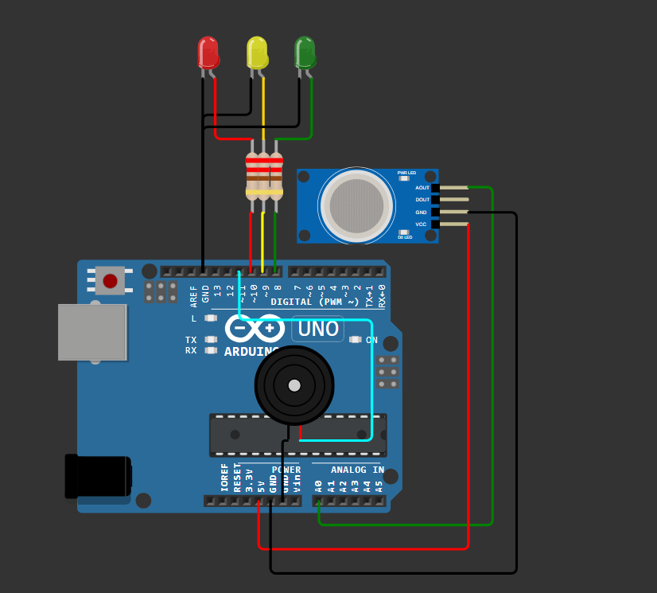
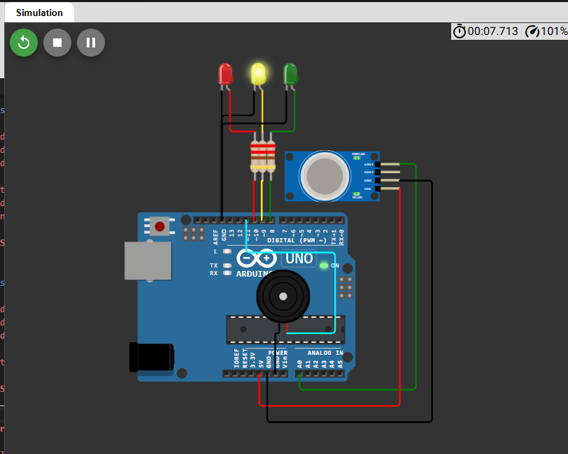
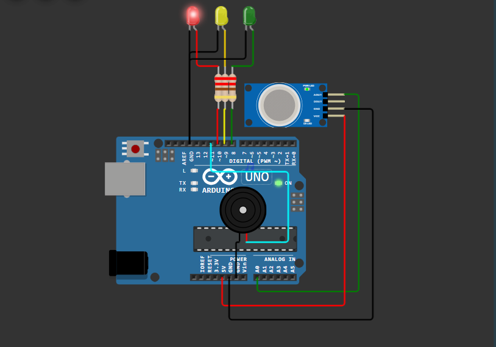
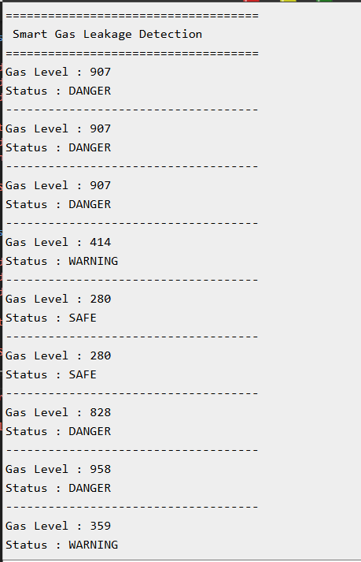

# Smart Gas Leakage Detection System ⛽

## Overview

The Smart Gas Leakage Detection System is an Arduino Uno–based safety monitoring project that continuously measures gas concentration using an MQ-2 gas sensor. Based on the detected gas level, the system classifies the environment into **Safe**, **Warning**, or **Danger** states, providing visual alerts through LEDs, an audible alarm using a piezo buzzer, and live updates on the Serial Monitor.

---

## Features

- Real-time gas concentration monitoring
- Three-level safety classification
- LED-based visual indication
- Piezo buzzer alarm
- Live Serial Monitor output
- Adjustable gas simulation in Wokwi

---

## Components Used

| Component | Quantity |
|----------|:--------:|
| Arduino Uno | 1 |
| MQ-2 Gas Sensor Module | 1 |
| Green LED | 1 |
| Yellow LED | 1 |
| Red LED | 1 |
| Piezo Buzzer | 1 |
| 220Ω Resistors | 3 |
| Jumper Wires | As Required |

---

## Pin Connections

| Component | Arduino Pin |
|----------|-------------|
| MQ-2 Analog Output | A0 |
| Green LED | D8 |
| Yellow LED | D9 |
| Red LED | D10 |
| Piezo Buzzer | D11 |

---

## Working Principle

The MQ-2 gas sensor continuously measures the surrounding gas concentration.

Arduino reads the analog sensor value and compares it with predefined threshold values to determine the current safety level.

- **Safe Mode**
  - Green LED ON
  - Yellow LED OFF
  - Red LED OFF
  - Buzzer OFF

- **Warning Mode**
  - Yellow LED ON
  - Green LED OFF
  - Red LED OFF
  - Short warning beep

- **Danger Mode**
  - Red LED ON
  - Green LED OFF
  - Yellow LED OFF
  - Continuous buzzer alarm

The current gas level and system status are displayed on the Serial Monitor.

---

## Project Structure

```text
Day-07-Smart-Gas-Leakage-Detection/
│
├── circuit/
│   └── circuit_diagram.png
│
├── code/
│   └── smart_gas_leakage_detection.ino
│
├── docs/
│   └── architecture.md
│
├── screenshots/
│   ├── safe_mode.png
│   ├── warning_mode.png
│   ├── danger_mode.png
│   └── serial_monitor.png
│
└── README.md
```

---

## Screenshots

### Circuit Diagram



### Safe Mode


### Warning Mode



### Danger Mode



### Serial Monitor



---

## Concepts Learned

- MQ-2 gas sensor interfacing
- Analog sensor reading
- ADC (Analog-to-Digital Conversion)
- Threshold-based decision making
- Multi-level alert systems
- Embedded safety monitoring
- Serial communication for debugging

---

## Future Improvements

- ESP32 Wi-Fi connectivity
- Email and mobile notifications
- Cloud-based monitoring dashboard
- Historical gas level logging
- Integration with smart home safety systems

---

## Author

**Smruthi Nayak**

B.Tech Computer Science Engineering