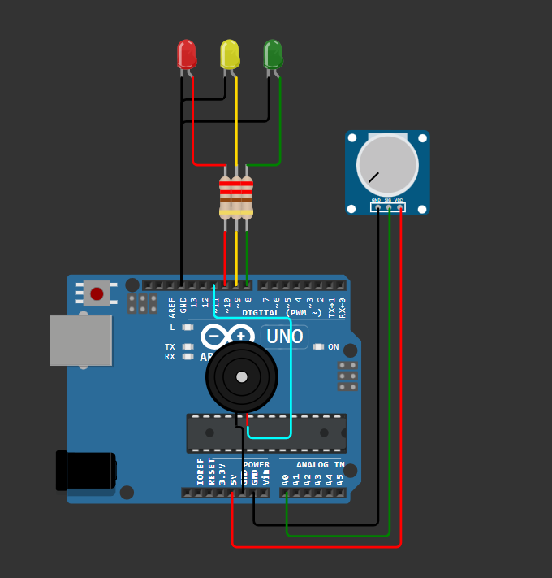
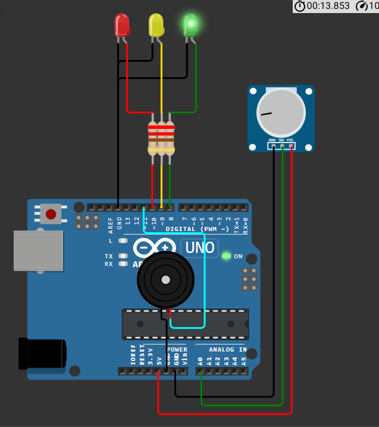
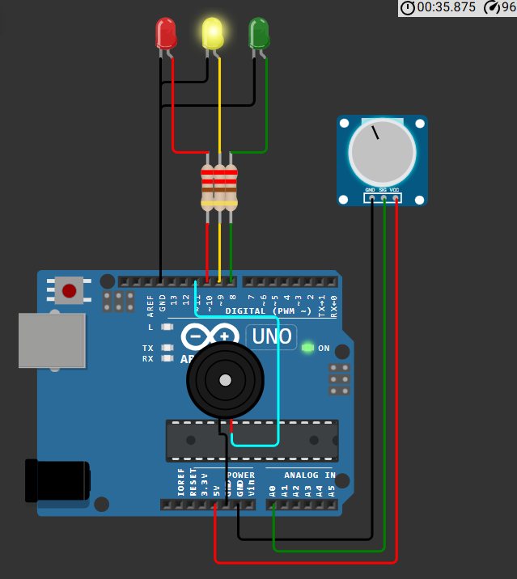
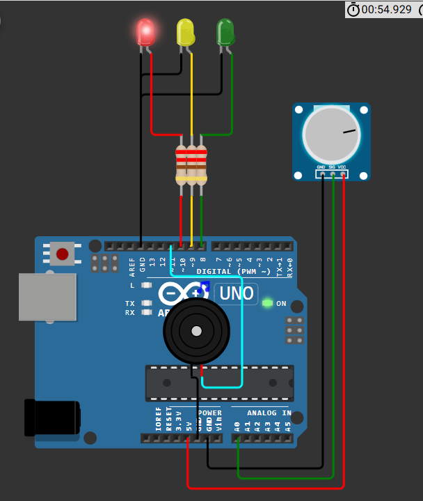
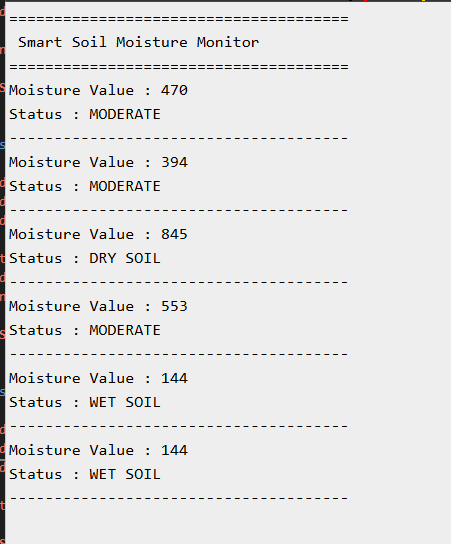

# Smart Soil Moisture Monitor 🌱

## Overview

An Arduino-based soil moisture monitoring system that continuously measures soil moisture levels and classifies the soil as Wet, Moderate, or Dry. The system provides visual indication using LEDs and alerts through a buzzer when the soil becomes too dry.

---

## Features

- Real-time soil moisture monitoring
- Three moisture status levels
- LED status indication
- Buzzer alert for dry soil
- Serial Monitor output
- Beginner-friendly Arduino project

---

## Components Used

- Arduino Uno
- Soil Moisture Sensor (Potentiometer in Wokwi)
- Red LED
- Yellow LED
- Green LED
- 3 × 220Ω Resistors
- Piezo Buzzer
- Jumper Wires

---

## Pin Connections

| Component | Arduino Pin |
|-----------|-------------|
| Soil Sensor | A0 |
| Green LED | D8 |
| Yellow LED | D9 |
| Red LED | D10 |
| Buzzer | D6 |

---

## Working

### Wet Soil
- Green LED ON
- Buzzer OFF

### Moderate Moisture
- Yellow LED ON
- Buzzer OFF

### Dry Soil
- Red LED ON
- Buzzer ON

---

## Screenshots

### Circuit

### Wet Soil

### Moderate Soil

### Dry Soil

### Serial Monitor

---

## Concepts Learned

- Analog Sensor Reading
- ADC Conversion
- Threshold-based Decision Making
- Digital Output Control
- Embedded Monitoring Systems

---

## Future Improvements

- IoT Dashboard
- ESP32 Wi-Fi Integration
- Automatic Irrigation Pump
- Mobile Notifications
- Cloud Monitoring

---

## Author

Smruthi Nayak