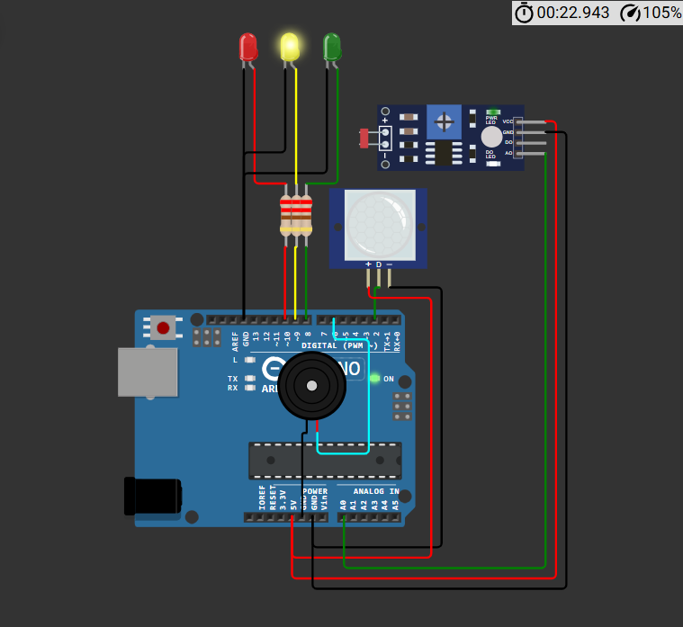
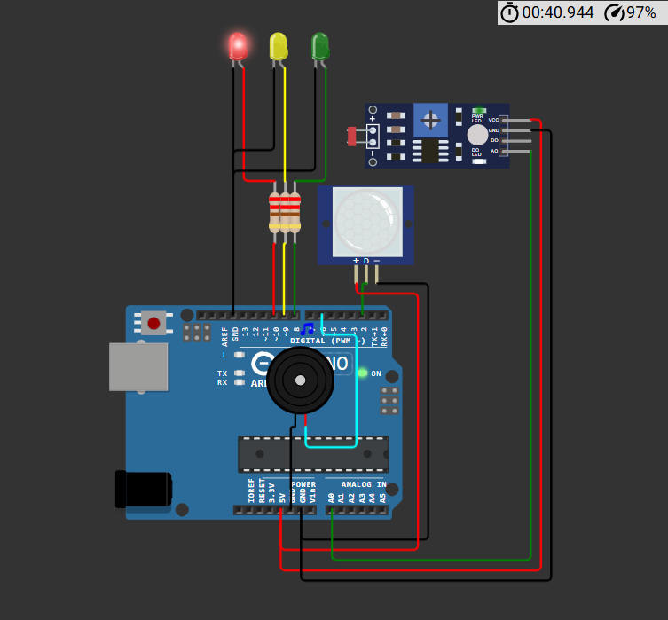
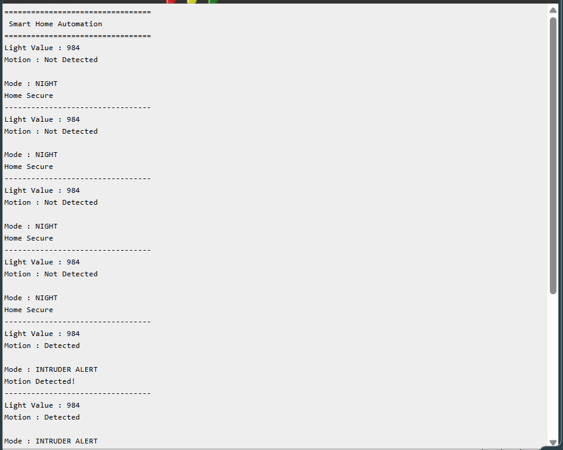

# Smart Home Automation 🏠

## Overview

The Smart Home Automation System is an Arduino Uno–based embedded project that combines an LDR sensor and a PIR motion sensor to monitor ambient lighting and detect human movement. Based on environmental conditions, the system automatically switches between **Day Mode**, **Night Mode**, and **Intruder Alert**, providing visual indications through LEDs, an audible alarm using a piezo buzzer, and live updates on the Serial Monitor.

---

## Features

- Automatic day and night detection
- Motion detection using PIR sensor
- Intruder alert system
- LED-based status indication
- Piezo buzzer alarm
- Live Serial Monitor output
- Beginner-friendly home automation project

---

## Components Used

| Component | Quantity |
|----------|:--------:|
| Arduino Uno | 1 |
| PIR Motion Sensor | 1 |
| LDR Sensor Module | 1 |
| Green LED | 1 |
| Yellow LED | 1 |
| Red LED | 1 |
| Piezo Buzzer | 1 |
| 220Ω Resistors | 3 |
| Jumper Wires | As Required |

---

## Pin Connections

| Component | Arduino Pin |
|----------|-------------|
| PIR Motion Sensor | D2 |
| LDR Sensor (AO) | A0 |
| Green LED | D8 |
| Yellow LED | D9 |
| Red LED | D10 |
| Piezo Buzzer | D6 |

---

## Working Principle

The LDR sensor continuously measures ambient light intensity, while the PIR sensor detects motion.

Arduino processes both sensor readings to determine the current operating mode.

- **Day Mode**
  - Green LED ON
  - Yellow LED OFF
  - Red LED OFF
  - Buzzer OFF

- **Night Mode**
  - Yellow LED ON
  - Green LED OFF
  - Red LED OFF
  - Home remains secure
  - Buzzer OFF

- **Intruder Alert**
  - Triggered when motion is detected during Night Mode
  - Red LED ON
  - Green LED OFF
  - Yellow LED OFF
  - Piezo buzzer activated

The current light level, motion status, and operating mode are displayed on the Serial Monitor.

---

## Project Structure

```text
Day-09-Smart-Home-Automation/
│
├── circuit/
│   └── circuit_diagram.png
│
├── code/
│   └── smart_home_automation.ino
│
├── docs/
│   └── architecture.md
│
├── screenshots/
│   ├── day_mode.png
│   ├── night_mode.png
│   ├── intruder_alert.png
│   └── serial_monitor.png
│
└── README.md
```

---

## Screenshots

### Circuit Diagram


### Day Mode


### Night Mode



### Intruder Alert



### Serial Monitor



---

## Concepts Learned

- LDR sensor interfacing
- PIR motion sensor interfacing
- Analog and digital sensor integration
- Multi-condition decision making
- Embedded home automation
- GPIO control
- Serial communication for debugging

---

## Future Improvements

- ESP32 Wi-Fi connectivity
- Email and mobile notifications
- Web-based home monitoring dashboard
- Smart appliance control using relays
- Cloud-based event logging

---

## Author

**Smruthi Nayak**

B.Tech Computer Science Engineering