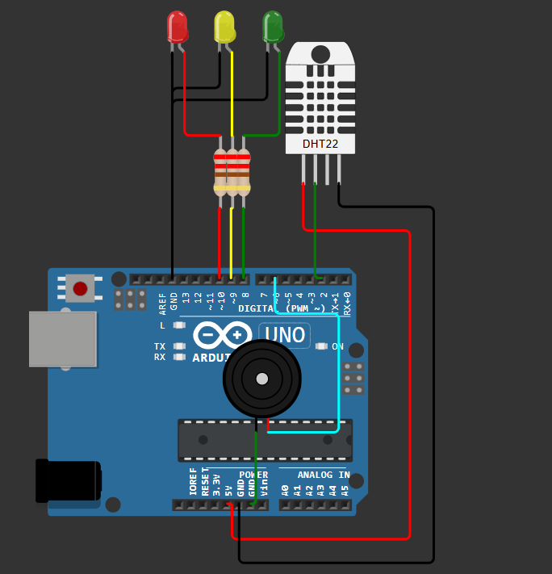
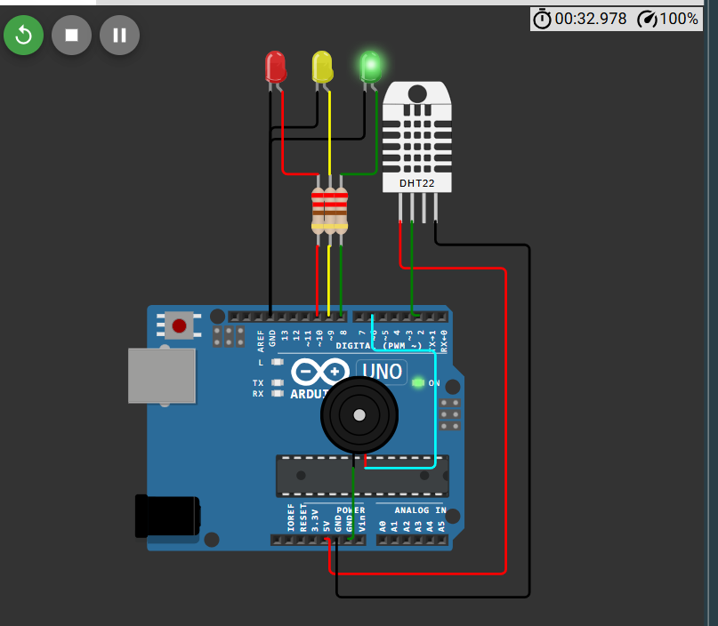
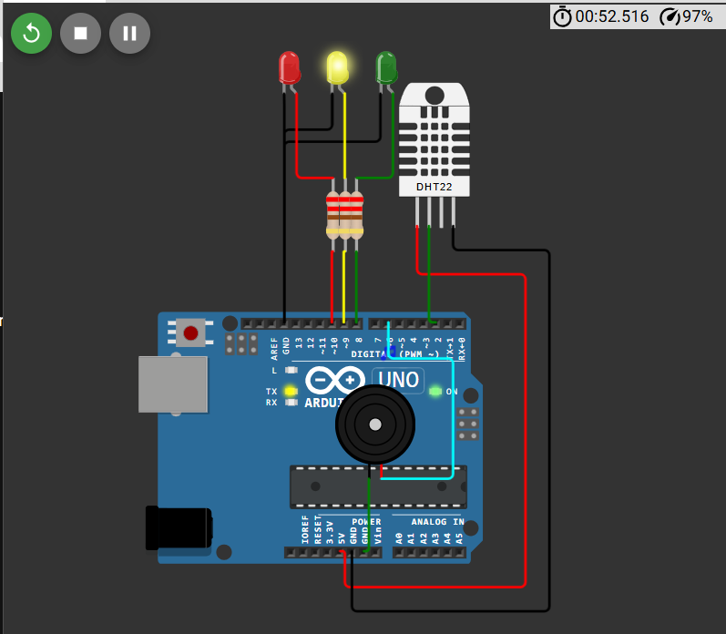
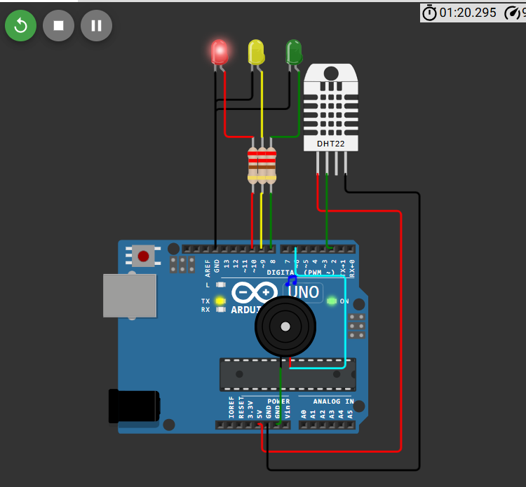
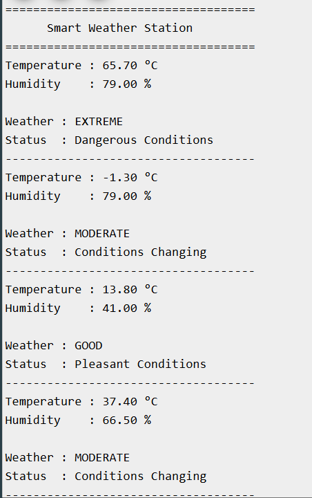

# Smart Weather Station 🌦️

## Overview

The Smart Weather Station is an Arduino Uno–based environmental monitoring system that continuously measures temperature and humidity using a DHT22 sensor. Based on predefined environmental thresholds, the system classifies the weather into **Good**, **Moderate**, or **Extreme** conditions and provides visual and audible alerts while displaying live sensor readings on the Serial Monitor.

---

## Features

- Real-time temperature monitoring
- Real-time humidity monitoring
- Three weather conditions
- LED-based status indication
- Piezo buzzer alert
- Live Serial Monitor output
- Beginner-friendly environmental monitoring project

---

## Components Used

| Component | Quantity |
|----------|:--------:|
| Arduino Uno | 1 |
| DHT22 Temperature & Humidity Sensor | 1 |
| Green LED | 1 |
| Yellow LED | 1 |
| Red LED | 1 |
| Piezo Buzzer | 1 |
| 220Ω Resistors | 3 |
| Jumper Wires | As Required |

---

## Pin Connections

| Component | Arduino Pin |
|----------|-------------|
| DHT22 Data | D2 |
| Green LED | D8 |
| Yellow LED | D9 |
| Red LED | D10 |
| Piezo Buzzer | D6 |

---

## Working Principle

The DHT22 sensor continuously measures temperature and humidity.

Arduino processes the sensor readings and classifies the weather into one of three conditions.

### Good Weather

- Green LED ON
- Yellow LED OFF
- Red LED OFF
- Buzzer OFF

### Moderate Weather

- Yellow LED ON
- Green LED OFF
- Red LED OFF
- Short buzzer notification

### Extreme Weather

- Red LED ON
- Green LED OFF
- Yellow LED OFF
- Continuous buzzer alarm

The current temperature, humidity, and weather status are displayed on the Serial Monitor.

---

## Project Structure

```text
Day-10-Smart-Weather-Station/
│
├── circuit/
│   └── circuit_diagram.png
│
├── code/
│   └── smart_weather_station.ino
│
├── docs/
│   └── architecture.md
│
├── screenshots/
│   ├── good_weather.png
│   ├── moderate_weather.png
│   ├── extreme_weather.png
│   └── serial_monitor.png
│
└── README.md
```

---

## Screenshots

### Circuit Diagram



### Good Weather



### Moderate Weather



### Extreme Weather



### Serial Monitor



---

## Concepts Learned

- DHT22 sensor interfacing
- Digital sensor communication
- Multi-parameter monitoring
- Threshold-based decision making
- Embedded environmental monitoring
- GPIO control
- Serial communication for debugging

---

## Future Improvements

- ESP32 Wi-Fi connectivity
- Web-based weather dashboard
- Email and mobile notifications
- Historical weather data logging
- Cloud-based environmental monitoring

---

## Author

**Smruthi Nayak**

B.Tech Computer Science Engineering