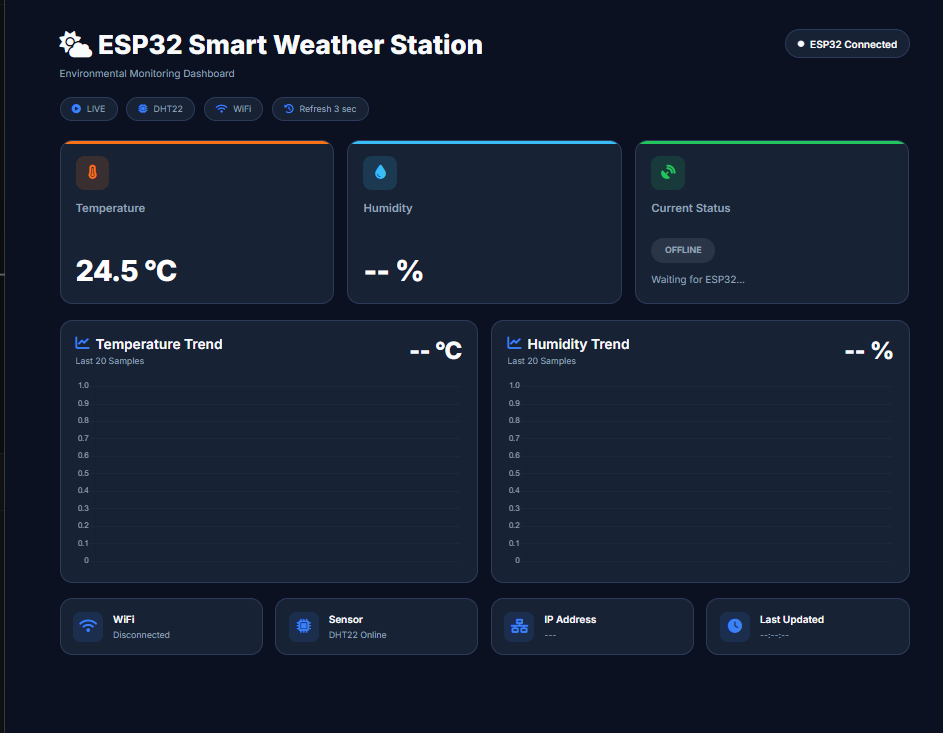
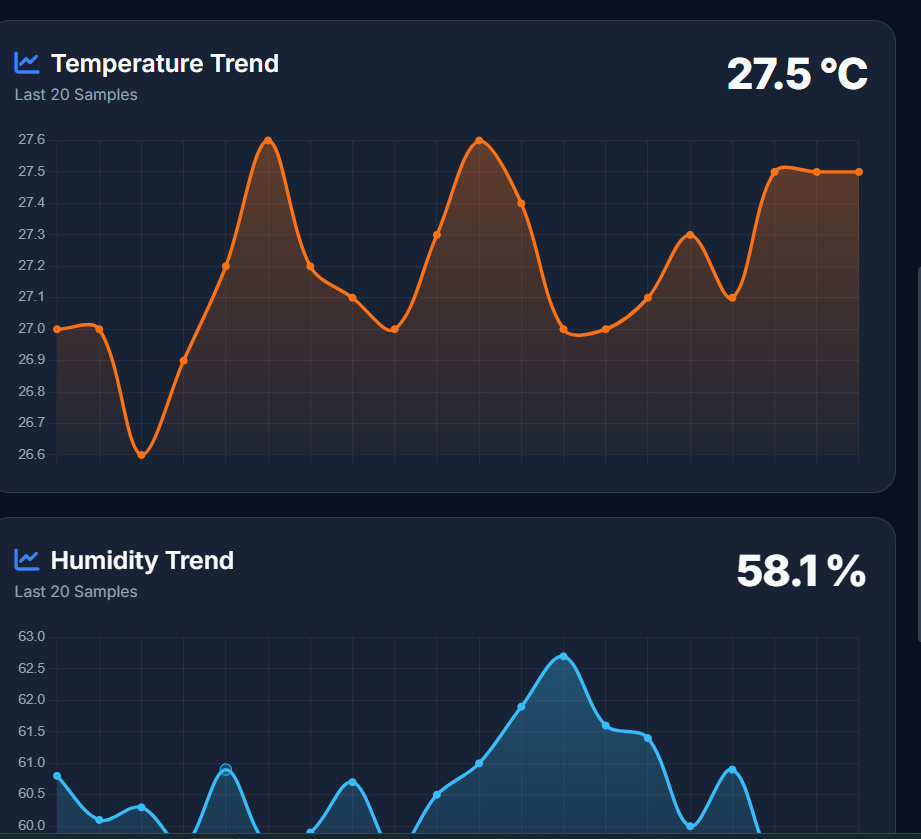
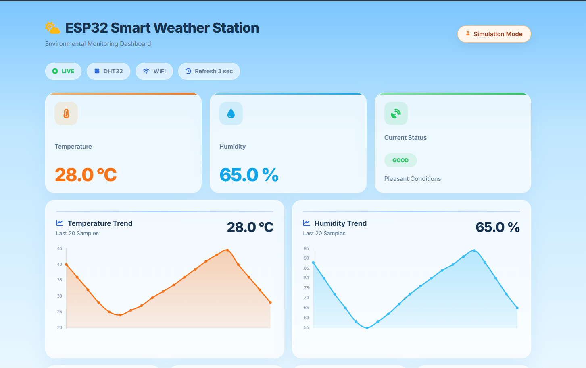
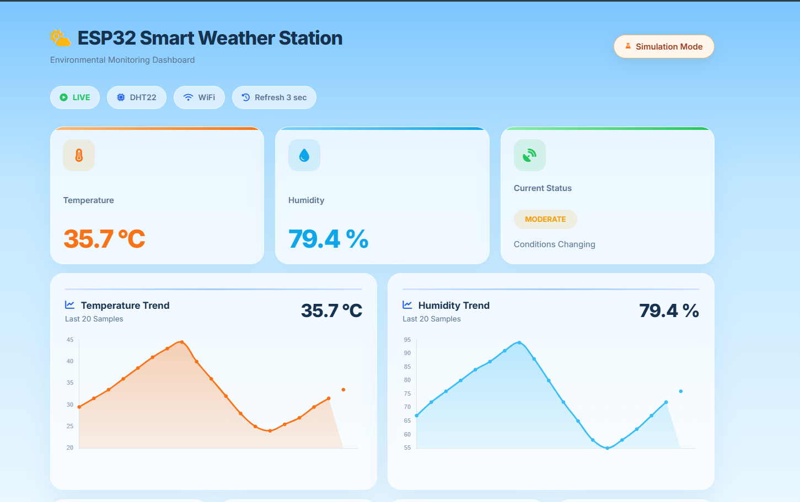
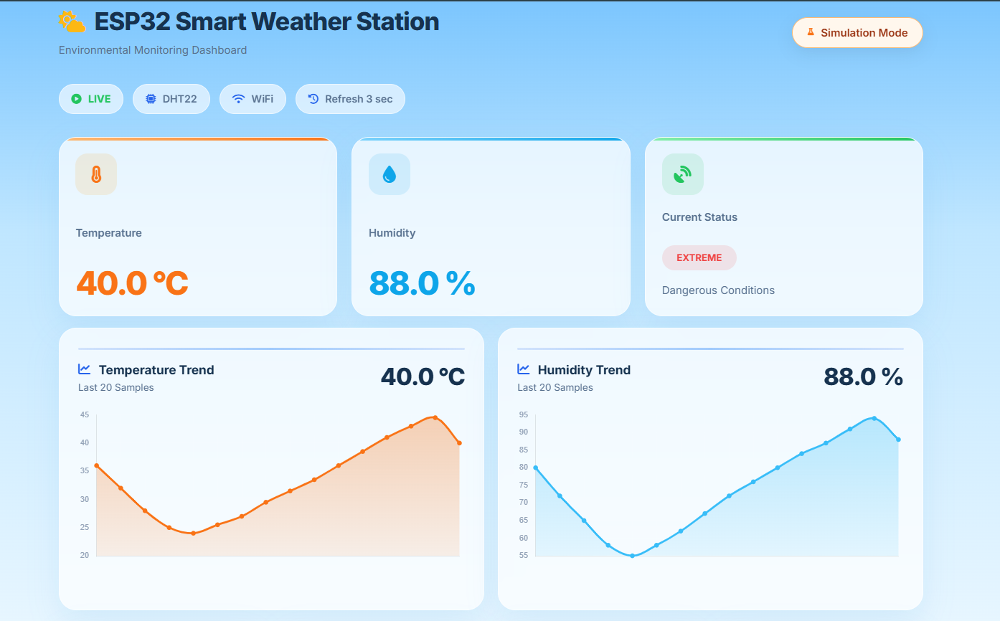
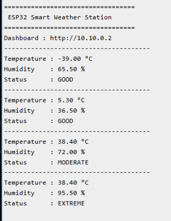
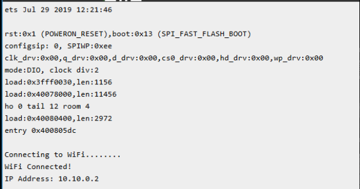

# 🌤️ ESP32 Smart Weather Station

A modern IoT-based weather monitoring system built with **ESP32**, **DHT22**, **Flask**, **JavaScript**, and **Chart.js**. The project provides a responsive web dashboard for monitoring environmental conditions in real time and automatically falls back to a realistic simulation mode when hardware is unavailable.

---

## 📌 Features

- 🌡️ Real-time Temperature Monitoring
- 💧 Real-time Humidity Monitoring
- 📊 Live Temperature & Humidity Charts
- 📡 Automatic ESP32 Connectivity Detection
- 🧪 Built-in Simulation Mode
- 🚦 Weather Status Classification
  - Good
  - Moderate
  - Extreme
- 🔄 Auto Refresh Dashboard
- 🎨 Modern Responsive UI
- ⚡ Flask REST API Backend

---

# 🏗️ Project Structure

```
Day-11-ESP32-Smart-Weather-Station
│
├── backend/
│   ├── app.py
│   ├── routes.py
│   ├── esp32_client.py
│   ├── simulation.py
│   ├── models.py
│   ├── config.py
│   └── requirements.txt
│
├── dashboard/
│   ├── index.html
│   ├── css/
│   └── js/
│
├── circuit/
│
├── code/
│
├── docs/
│
├── screenshots/
│
└── README.md
```

---

# ⚙️ Technology Stack

| Category | Technology |
|----------|------------|
| Microcontroller | ESP32 |
| Sensor | DHT22 |
| Backend | Python, Flask |
| Frontend | HTML, CSS, JavaScript |
| Charts | Chart.js |
| Communication | HTTP REST API |

---

# 🚀 How It Works

1. ESP32 reads temperature and humidity from the DHT22 sensor.
2. The ESP32 exposes sensor readings over HTTP.
3. Flask fetches the latest readings from the ESP32.
4. If the ESP32 is unavailable, the backend automatically switches to Simulation Mode.
5. The dashboard polls the backend every few seconds.
6. Live values and charts update automatically.

---

# 🧪 Simulation Mode

When the ESP32 is not reachable, the application automatically enables **Simulation Mode**.

Simulation Mode provides:

- Dynamic temperature values
- Dynamic humidity values
- Automatic status changes
- Live chart updates
- Clear visual indicators that hardware is not connected

The dashboard displays:

- Simulation Mode badge
- Simulation network status
- Simulation sensor status
- Simulation IP information

This allows the application to be demonstrated without physical hardware.

---

# 📊 Weather Status Logic

| Status | Temperature | Humidity |
|---------|------------:|---------:|
| 🟢 Good | < 30°C | < 70% |
| 🟡 Moderate | < 40°C | < 85% |
| 🔴 Extreme | ≥ 40°C | ≥ 85% |

---

# 📸 Screenshots

## Dashboard Overview



---

## ESP32 Live Dashboard



---

## Good Weather



---

## Moderate Weather



---

## Extreme Weather



---

## Serial Monitor



---

## WiFi Connected



---

# ▶️ Getting Started

## 1. Clone the Repository

```bash
git clone https://github.com/<your-username>/IoT-Engineering-Portfolio.git
```

---

## 2. Navigate to the Project

```bash
cd Day-11-ESP32-Smart-Weather-Station
```

---

## 3. Install Backend Dependencies

```bash
cd backend

pip install -r requirements.txt
```

---

## 4. Start the Flask Server

```bash
python app.py
```

Backend:

```
http://127.0.0.1:5000
```

API:

```
http://127.0.0.1:5000/api/data
```

---

## 5. Launch the Dashboard

Open:

```
dashboard/index.html
```

or run a local server such as:

```bash
python -m http.server
```

---

# 📡 API Response

```json
{
  "temperature": 27.4,
  "humidity": 63.8,
  "status": "GOOD",
  "description": "Pleasant Conditions",
  "ip": "192.168.1.25",
  "online": true,
  "simulated": false,
  "timestamp": "10:15:42"
}
```

---

# 🎯 Future Improvements

- MQTT Communication
- Historical Data Storage
- Multiple Sensor Support
- Weather Alerts
- Mobile Application
- Cloud Dashboard
- Data Export (CSV/PDF)
- Authentication

---

# 👩‍💻 Author

**Smruthi Nayak**

B.Tech Computer Science & Engineering

Passionate about IoT, Embedded Systems, and Cybersecurity.

---

## ⭐ If you found this project useful, consider giving it a star.